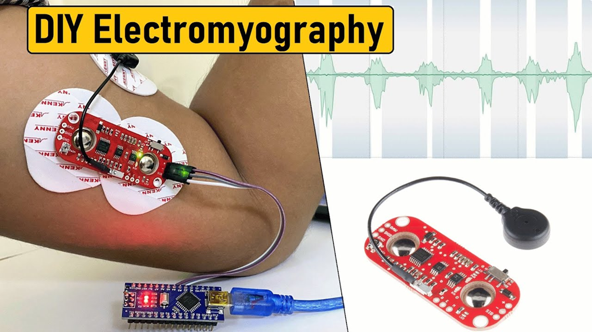
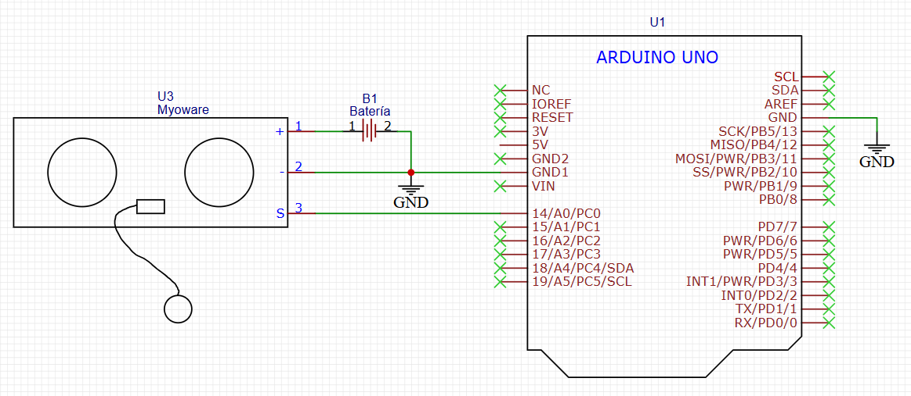

# 📘 Lectura Básica del Sensor EMG MyoWare con Arduino

Este ejemplo permite leer la señal eléctrica generada por un **sensor EMG MyoWare**, que detecta la actividad muscular superficial. Utilizando un Arduino UNO, se captura la señal analógica y se visualiza en tiempo real mediante el monitor serial.

   
  <em>Figura 1. Imagen referencial.</em>

---

## 🧪 ¿Qué es un sensor EMG?

El sensor **EMG (Electromiografía)** MyoWare mide la actividad eléctrica generada por los músculos esqueléticos cuando se contraen. Esta señal bioeléctrica es amplificada, filtrada y entregada como una señal analógica que puede ser leída por un microcontrolador.

---

## 🔬 Principio de funcionamiento

- Los músculos generan **potenciales de acción** durante la contracción, que pueden detectarse con electrodos de superficie.
- El sensor MyoWare incluye un amplificador y un filtro paso banda que entrega una señal analógica proporcional a la actividad muscular.
- El voltaje de salida varía típicamente entre **0.5 V (reposo)** y **~3.5 V (contracción intensa)**.

---

## 🔧 Esquema de conexión

| Sensor EMG (MyoWare) | Arduino UNO |
|----------------------|-------------|
| V+                   | 5V          |
| GND                  | GND         |
| SIG (out)            | A0          |

- Se debe conectar el cable de señal (SIG) al pin **A0** del Arduino.
- Los electrodos deben colocarse sobre el músculo deseado (ej. bíceps, antebrazo), con uno de referencia en una zona neutra como el codo o muñeca.

   
  <em>Figura 2. Esquema de conexión eléctrica del ejemplo</em>

---

## 💻 Código del ejemplo

Consulta el archivo: `EMG_basic_read.ino`

Este programa:
- Lee el valor analógico del pin A0.
- Muestra la señal en el monitor serial cada 100 ms.
- Permite observar la respuesta muscular ante diferentes contracciones en tiempo real.

---

## 📈 Aplicaciones biomédicas

- **Control de prótesis mioeléctricas**
- **Interfaces hombre-máquina activadas por músculo**
- **Monitoreo en terapias de rehabilitación muscular**
- **Sistemas de entrenamiento y biofeedback**

---

## 📎 Requisitos

- Sensor **EMG MyoWare**
- 3 electrodos autoadhesivos de gel (Ag/AgCl)
- 1 placa Arduino UNO o compatible
- Protoboard y cables Dupont
- Alcohol isopropílico para limpieza de piel
- Arduino IDE instalado (v1.8.x o 2.x)

---

## 🎥 Material Complementario

A continuación se presentan algunos videos recomendados para reforzar los conceptos abordados sobre EMG, activación muscular y control neuromuscular:

- 📄 [Guía de Introducción a EMG – PLUX BioSignals (PDF)](https://support.pluxbiosignals.com/wp-content/uploads/2022/04/HomeGuide1_EMG.pdf)
- 📺 [MyoWare Muscle Sensor - Electromyography & Robot Arm (Inglés)](https://www.youtube.com/watch?v=wMVL3d2dN9U)

Estos materiales visuales complementan la comprensión del origen fisiológico de la señal EMG y su aplicación en sistemas biomédicos.

---

## 🧑‍🏫 Créditos

Este ejemplo fue desarrollado para el curso **Fundamentos de Biodiseño**  
Docentes: **Renzo Chan Ríos** / **Lewis De La Cruz**  
Universidad Peruana Cayetano Heredia (UPCH) — 2025  
Versión: 0.1

---

