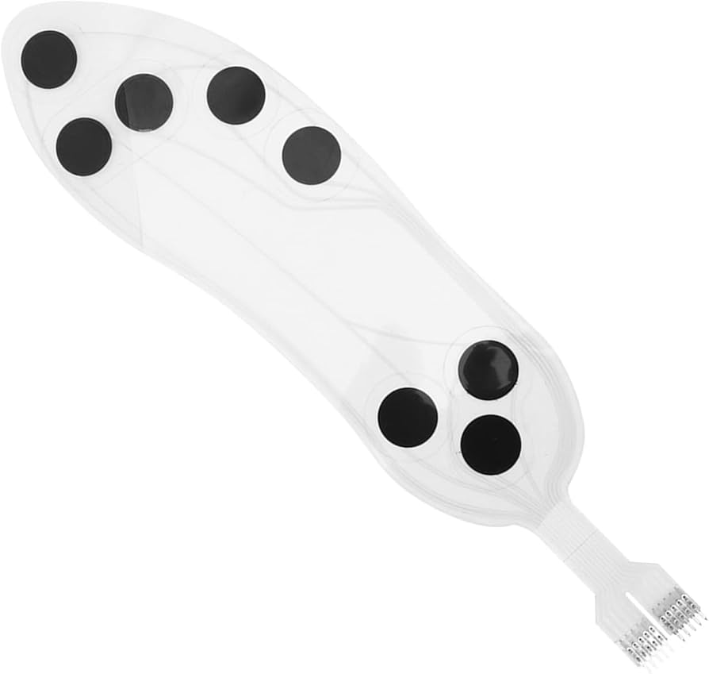

# 🔴 FSR Pressure Alert – Alerta de Presión con Doble Sensor FSR

Este mini proyecto utiliza dos sensores FSR conectados a una placa Arduino para monitorear la presión ejercida en dos puntos. Si la presión en cualquiera de los sensores supera un umbral definido, se activa un LED como alerta visual. 

   
  <em>Figura 1. Imagen Referencial generada con IA</em>

---

## 🎯 Objetivo

- Detectar presión mecánica desde dos sensores FSR.
- Activar una salida visual (LED) si cualquiera de los sensores supera un umbral.
- Promediar lecturas para mayor estabilidad y confiabilidad de la medición.

---

## 🔬 ¿Qué es un sensor FSR?

Un **FSR (Force Sensitive Resistor)** es un sensor cuya **resistencia disminuye cuando se aplica presión**. Al colocarlo en un divisor de voltaje, puede generar una señal analógica proporcional a la fuerza aplicada.

---

## ⚙️ Funcionamiento del código

- Se utilizan **dos sensores FSR** conectados a A0 y A1.
- Cada sensor aplica un filtro de promedio de 10 lecturas.
- Si cualquiera de las señales supera el **umbral predefinido** (ej. 600), se activa el LED de alerta.
- El sistema muestra los valores y el estado de cada sensor en el monitor serial.

---

## 🧪 Aplicaciones biomédicas

| Aplicación                        | Descripción breve                                                 |
|----------------------------------|-------------------------------------------------------------------|
| Alerta de **úlceras por presión** | Monitorea zonas de apoyo (como glúteos) con dos puntos sensibles. |
| **Control de postura bilateral** | Detecta asimetrías en la distribución del peso corporal.          |
| **Entrenamiento sensorial dual** | Proporciona feedback táctil desde dos zonas corporales distintas. |
| **Evaluación de prótesis**       | Compara carga izquierda/derecha o entre dos puntos de contacto.   |

---

## 🔌 Conexiones sugeridas

| Componente | Arduino UNO |
|------------|-------------|
| FSR 1      | A0 (con divisor resistivo a 10kΩ y 5V) |
| FSR 2      | A1 (igual configuración)               |
| LED (alerta) | Pin 9 con resistencia de 220Ω         |

---

## 📈 Visualización

Los valores de ambos sensores se imprimen por el monitor serial a 9600 baudios. Se recomienda usar el **Serial Plotter** para visualizar las dos curvas de presión.

---

## 👨‍🏫 Créditos

Desarrollado para el curso **Fundamentos de Biodiseño**  
Docentes: **Renzo Chan Ríos** / **Lewis De La Cruz**  
Universidad Peruana Cayetano Heredia (UPCH) — 2025  
Versión: 0.4

---
