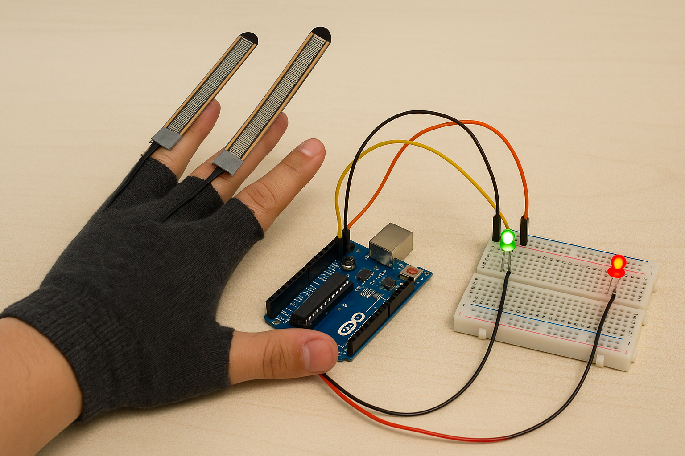

# ✋ Flex Glove Dual – Versión Educativa con Filtro Promedio

  

Este proyecto permite leer dos sensores **Flex** colocados en los dedos y controlar la **intensidad de dos LEDs** (verde y rojo) proporcionalmente al ángulo de flexión. Se aplica un **filtro por promedio simple** para suavizar la señal, con comentarios detallados para estudiantes que están iniciando en programación y electrónica biomédica.

---

## 🎯 Objetivo del proyecto

- Comprender cómo usar sensores de flexión (resistivos) para medir el movimiento de los dedos.
- Aplicar la lectura analógica y convertirla en salida proporcional mediante PWM.
- Implementar un **promedio de lecturas** para mejorar la estabilidad de la señal.

---

## 🔬 Fundamento del sensor

El **sensor Flex** cambia su resistencia cuando se dobla. Al integrarlo con un divisor de voltaje, la salida analógica varía con el ángulo de flexión. Arduino mide esta señal mediante su ADC interno.

---

## ⚙️ Funcionamiento del programa

1. Se leen 10 muestras consecutivas por sensor usando `analogRead()`.
2. Se calcula el **promedio** para reducir ruido.
3. El valor promedio se mapea al rango **0–255**, correspondiente a la salida PWM del LED.
4. Se controla cada LED con `analogWrite()`, ajustando su brillo.

---

## 📈 ¿Por qué usar filtro por promedio?

El promedio permite:
- **Reducir el ruido** en señales analógicas inestables.
- **Suavizar la respuesta** visual del LED.
- Evitar falsos positivos debido a interferencias o lecturas erráticas.

Un pequeño retardo de `10 µs` entre lecturas mejora la estabilidad del ADC de Arduino.

---

## 🧪 Requisitos

- 2 sensores Flex
- 2 LEDs (verde y rojo)
- 2 resistencias (220Ω para LEDs)
- Arduino UNO o similar
- Protoboard y cables
- Arduino IDE (v1.8.x o v2.x)

---

## 📈 Aplicaciones sugeridas

- Guantes interactivos para rehabilitación o entrenamiento
- Sistemas de control gestual
- Proyectos de biofeedback para educación o deporte

---

## 🧑‍🏫 Créditos

Desarrollado para el curso **Fundamentos de Biodiseño**  
Docentes: **Renzo Chan Ríos** / **Lewis De La Cruz**  
Universidad Peruana Cayetano Heredia (UPCH) — 2025  
Versión: 0.6

---
